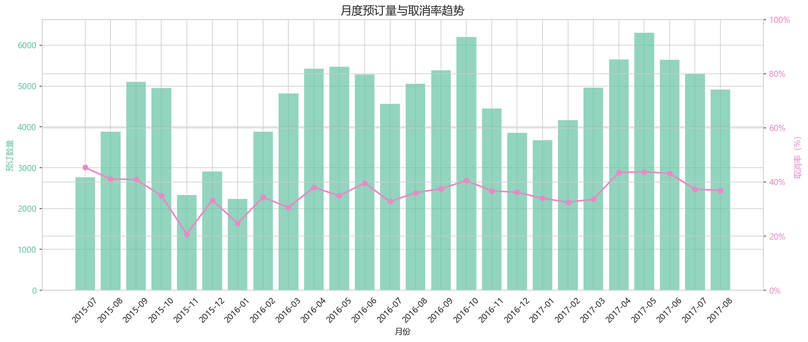
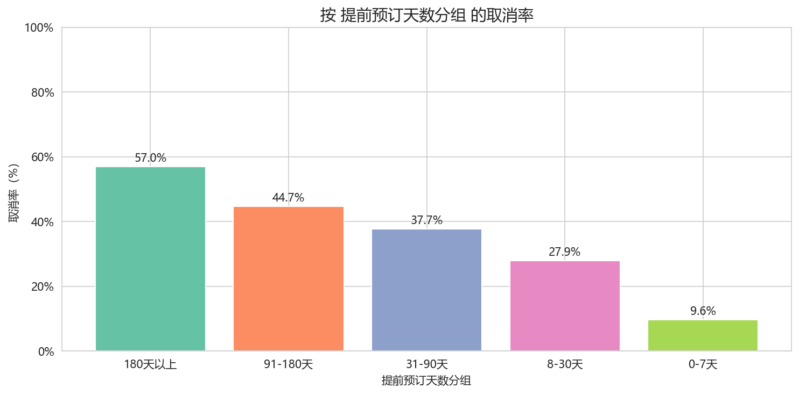
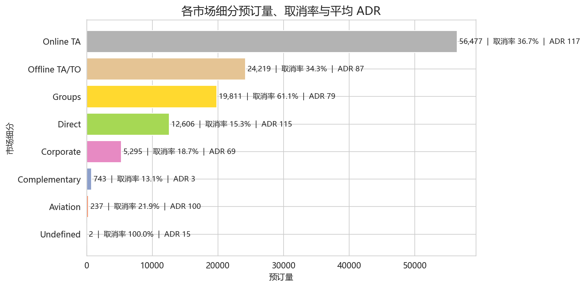
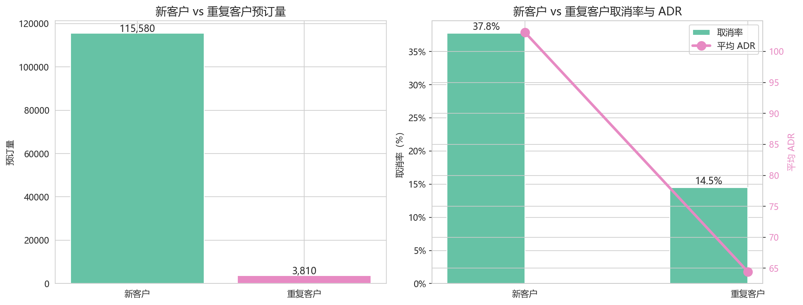
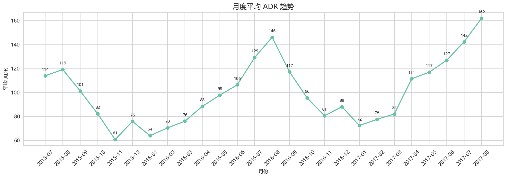
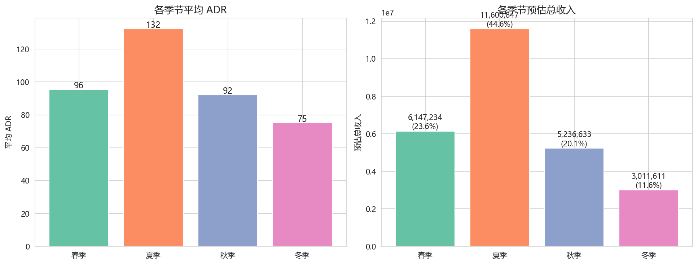

# Hotel Booking Cancellation and Demand Analysis

基于 Pandas 的酒店预订取消与客户需求分析

---

## 项目背景

酒店预订取消直接影响库存管理、收入预测、房型分配和运营决策。一次取消不仅意味着空房损失，还会打乱动态定价策略与人员排班计划。

本项目使用 11.9 万条真实酒店预订记录，利用 Pandas 生态系统从**取消行为、客户渠道、价格收入、入住时长与提前预订**四个维度展开探索性数据分析（EDA），最终形成可落地的业务建议。

---

## 数据说明

本项目不上传原始数据文件。原始数据请从 Kaggle Hotel Booking Demand Dataset 下载后放入 `data/raw/` 目录。

仓库中保留清洗后的数据文件 `data/processed/hotel_bookings_cleaned.csv`，用于复现后续分析与可视化结果。

---

## 技术栈

Python · Pandas · NumPy · Matplotlib · Seaborn · Jupyter Notebook · VS Code · Claude Code

---

## 项目结构

```
.
├── data/
│   └── processed/
│       └── hotel_bookings_cleaned.csv
│
├── notebooks/
│   ├── 01_data_overview_cleaning.ipynb        # 数据概览与清洗
│   ├── 02_cancellation_demand_analysis.ipynb   # 取消行为与需求趋势
│   ├── 03_customer_channel_analysis.ipynb      # 客户结构与渠道分析
│   ├── 04_price_revenue_analysis.ipynb         # ADR 房价与收入贡献
│   └── 05_stay_leadtime_behavior_analysis.ipynb # 入住时长与提前预订分析
│
├── src/
│   ├── config.py              # 路径与常量配置
│   ├── data_cleaning.py       # 数据加载与缺失值处理
│   ├── feature_engineering.py # 衍生字段构造
│   ├── analysis.py            # 分析函数（18 个可复用函数）
│   └── visualization.py       # 绘图风格与图表保存
│
├── outputs/
│   └── figures/               # 分析图表（23 张 PNG）
│
├── reports/
│   ├── project_report.md      # 正式项目分析报告
│   └── project_summary.md     # 简历与面试复盘材料
│
├── requirements.txt
└── README.md
```

---

## 分析流程

### 01 — 数据概览、缺失值处理与衍生字段构造

- 读取 119,390 条原始数据，完成数据类型检查与基本统计描述
- 处理 5 个缺失字段：`company`（94.3% 缺失 → 转布尔标识）、`agent`（13.7% 缺失 → 填充 0）、`country`（0.41% 缺失 → "Unknown"）、`children`（4 条缺失 → 填充 0）
- 构造 9 个衍生字段：`arrival_date`, `total_nights`, `total_guests`, `is_family`, `lead_time_group`, `adr_level`, `season`, `room_match`, `is_valid_guest`

### 02 — 取消行为与需求趋势分析

- 从 6 个维度剖析取消率：酒店类型、提前预订天数、押金类型、市场细分、客户类型、特殊需求数量
- 月度取消率趋势（双轴图）与非取消订单的真实入住需求趋势

### 03 — 客户结构与预订渠道分析

- 酒店类型预订分布、客户类型结构、市场细分与分销渠道对比
- 客源国 Top 10 分析
- 重复客户 vs 新客户的预订行为差异

### 04 — ADR 房价与收入贡献分析

- 构造 `estimated_revenue = adr × total_nights`，仅统计未取消订单
- 按酒店类型、市场细分、客户类型、季节、月份维度分析 ADR 与收入贡献
- 单独汇总取消订单的潜在收入损失

### 05 — 入住时长与提前预订行为分析

- 入住时长分组（1晚 / 2-3晚 / 4-7晚 / 8晚以上）与提前预订分组分析
- 家庭客户 vs 非家庭客户行为差异（取消率、入住晚数、ADR 三面板对比）
- 不同季节、不同酒店类型下的入住行为模式
- Hotel × Lead Time Group 交叉取消率分析

---

## 数据清洗与特征工程

| 处理项 | 策略 |
|--------|------|
| `company` 缺失率 94.3% | 构造 `has_company` 布尔字段后删除原列 |
| `agent` 缺失率 13.7% | 填充 0，构造 `has_agent` 布尔字段 |
| `country` 缺失率 0.41% | 填充 "Unknown" |
| `children` 4 条缺失 | 填充 0，转为 int |
| `reservation_status_date` | 转为 datetime 类型 |
| 衍生 `arrival_date` | 由 `arrival_date_year/month/day` 拼接为 datetime |
| 衍生 `total_nights` | `stays_in_weekend_nights + stays_in_week_nights` |
| 衍生 `total_guests` | `adults + children + babies` |
| 衍生 `is_family` | `children + babies > 0` |
| 衍生 `lead_time_group` | 0-7天 / 8-30天 / 31-90天 / 91-180天 / 180天以上 |
| 衍生 `adr_level` | 低价 / 中价 / 高价 / 异常（基于分位数） |
| 衍生 `season` | 春 / 夏 / 秋 / 冬（北半球气象季节） |
| 衍生 `room_match` | `reserved_room_type == assigned_room_type` |

---

## 核心分析问题

1. 酒店整体取消率是多少？City Hotel 和 Resort Hotel 的取消率是否存在差异？
2. 提前预订天数是否影响取消率？远期预订的取消风险有多大？
3. 不同押金类型（No Deposit / Non Refund / Refundable）的取消行为有何差异？
4. 哪些市场细分和分销渠道的取消率最高、ADR 最高？
5. 特殊请求数量是否能反映客户的入住意愿？
6. 酒店需求是否存在月份和季节性波动？
7. 不同客户类型和渠道的收入贡献结构是怎样的？
8. 入住时长和提前预订行为有什么规律？家庭客户与非家庭客户有何不同？
9. 取消订单造成了多少潜在收入损失？

---

## 核心发现

### 1. 整体取消率高达 37%

超过三分之一的预订最终被取消。City Hotel 的取消率显著高于 Resort Hotel，城市酒店面临更大的取消风险敞口。

### 2. 提前预订时间与取消率强正相关

提前 180 天以上的订单取消率接近 70%，而 0-7 天内的仅约 10%。提前预订天数越长，客户行程变数越大，取消概率越高。同时，远期预订的 ADR 通常更低（早鸟折扣），形成"低价高取消风险"的双重困局。

### 3. 特殊需求是忠诚信号

客户提出的特殊需求数量与取消率呈明显的负相关——特殊需求越多，取消率越低。这说明主动提出需求的客户入住意愿更坚定，可以作为预测取消风险的先行指标。

### 4. 渠道质量分化严重

Direct 直销渠道的取消率最低、ADR 最高，是质量最优的渠道。GDS（全球分销系统）取消率超过 53%，亟需风控介入。Online TA 是最大的流量入口，但取消率和 ADR 均处于中等水平。

### 5. 客源高度集中，Top 5 国家占绝对多数

PRT（葡萄牙）、GBR（英国）、FRA（法国）、DEU（德国）、ESP（西班牙）合计贡献了超过 60% 的预订量。市场推广资源集中投放即可覆盖大部分客源。

### 6. 重复客户仅占 3%，但价值显著更高

重复客户的取消率（约 19%）远低于新客户（约 38%），且平均 ADR 更高。客户忠诚度计划有巨大的提升空间——将新客户转化为回头客可同时降低取消率和提升客单价。

### 7. 夏季是旺季也是取消高峰

夏季入住需求最高、平均入住晚数最长、ADR 和收入全年最高，但取消率同样处于高位。旺季客户选择多、比价行为频繁，需加强收益管理与取消控制。

### 8. 长住客户是高质量细分市场

入住 8 晚以上的长住订单单笔收入远高于 1 晚订单，且取消率更低。家庭客户入住晚数更长、取消意愿更低，是值得重点维护的高价值客群。

---

## 可视化展示

### 月度预订量与取消率趋势



### 提前预订天数与取消率关系



### 市场细分渠道对比



### 重复客户 vs 新客户



### 月度 ADR 趋势



### 季节收入对比



---

## 业务建议

### 1. 针对高取消率渠道建立差异化风控

GDS 渠道取消率超过 53%，建议对该渠道引入适度的预付保证金或不可退款条款。Direct 渠道取消率最低、ADR 最高，应加大直销渠道的营销投入。

### 2. 对远期预订实施取消风险分级管理

提前 90 天以上的订单取消风险急剧上升。建议对远期订单推出"早鸟不可退款价"与"弹性可退款价"双轨定价，用价格折让换取取消确定性，同时允许风险承受能力低的客户选择弹性方案。

### 3. 将特殊需求作为取消预测的特征信号

特殊请求数量与取消率负相关，可将此信号纳入取消预测模型或运营流程——对零特殊请求的远期订单主动发送确认提醒，降低"遗忘式取消"。

### 4. 旺季实施收益管理，淡季拉动需求

夏季需求旺盛但取消率也高，应采用动态定价和超售策略（在安全范围内）最大化收入。冬季需求低但入住行为稳定，可推出长住套餐和家庭亲子产品以填补空房。

### 5. 投资客户忠诚度计划

重复客户仅占 3%，但其取消率低 19 个百分点、ADR 更高。若能将重复客户比例提升至 5-8%，预计可显著拉低整体取消率并提升 ARPU（每用户平均收入）。

### 6. 为家庭客户设计专属产品

家庭客户入住晚数更长、取消率更低、单笔收入更高。建议推出家庭连住优惠、亲子套餐、加床/加早餐服务，吸引并留住这一高价值客群。

### 7. 优化 City Hotel 的 1 晚订单管理

City Hotel 的 1 晚订单取消率最高、单笔收入最低。可评估在非高峰时段设置最低入住晚数要求，或对 1 晚订单提供"预付不可退"价格选项。

---

## 如何运行

```bash
# 1. 克隆项目
git clone <repo-url>
cd pandas-hotel-booking-analysis

# 2. 安装依赖
pip install -r requirements.txt

# 3. 按顺序运行 Notebook
jupyter notebook notebooks/01_data_overview_cleaning.ipynb
jupyter notebook notebooks/02_cancellation_demand_analysis.ipynb
jupyter notebook notebooks/03_customer_channel_analysis.ipynb
jupyter notebook notebooks/04_price_revenue_analysis.ipynb
jupyter notebook notebooks/05_stay_leadtime_behavior_analysis.ipynb
```

注意：Notebook 01 会生成 `data/processed/hotel_bookings_cleaned.csv`，后续 Notebook 02-05 依赖此文件。请确保按顺序运行。

---

## 项目总结

本项目展示了一套完整的 **Pandas 数据分析工作流**——从原始数据读取、缺失值处理、衍生字段构造，到多维度探索性数据分析、可视化呈现和业务建议提炼。项目覆盖了酒店预订场景下的核心分析主题（取消行为、客户渠道、价格收入、入住行为），产出了 23 张图表和 18 个可复用的分析函数，可作为数据科学或商业分析岗位的作品集项目。
